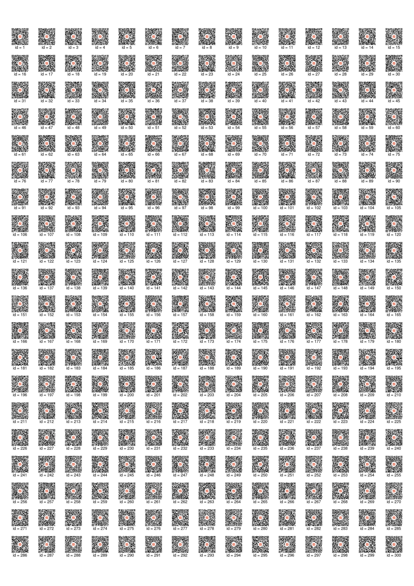
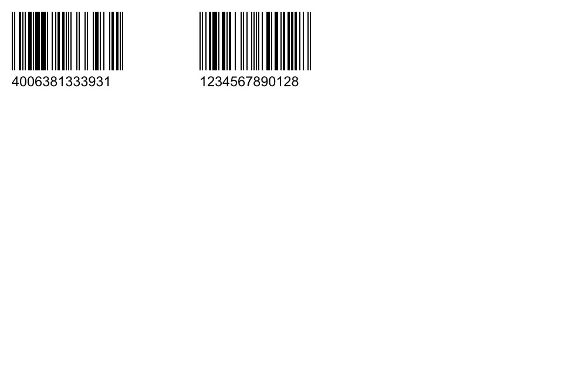

# 🐳 DotPlus — Docker Release

## 🇷🇺 Русский (RU)

**DotPlus CLI** — это кроссплатформенная утилита для генерации QR-кодов, штрихкодов и PDF-документов из CSV.  
Собрано на Rust, использует встроенный ImageMagick 6. Поддержка CLI и планируемый GUI-режим.

> ❗ Программа распространяется как **бесплатное проприетарное ПО**, исходный код не публикуется. Подробнее — в разделе [Лицензия](#-лицензия).

🔗 [DockerHub](https://hub.docker.com/r/nigdanil/dotplus-cli)  
🌐 [Сайт](https://dot-plus.ru)  
📬 [Поддержка](mailto:danil.communication@gmail.com) • [Telegram](https://t.me/NigDanil)

---

### 🚀 Быстрый старт

#### 📌 Пример QR

```bash
docker run --rm \
  -v "$PWD/examples:/examples" \
  nigdanil/dotplus-cli:1.0.0 \
  --mode qr \
  --csv "/examples/magnit/data/qr/magnit.csv" \
  --logo "/examples/magnit/logo/v1.png" \
  --output "/examples/magnit/img/qr" \
  --cols 3 \
  --rows 3 \
  --qr-size 150 \
  --font-size 24 \
  --font-color "#000000"
```

#### 📌 Пример штрихкодов

```bash
docker run --rm \
  -v "$PWD/examples:/examples" \
  nigdanil/dotplus-cli:1.0.0 \
  --mode barcode \
  --csv "/examples/magnit/data/barcode/magnit-barcodes-EAN-13.csv" \
  --output "/examples/magnit/img/barcode" \
  --barcode-type EAN-13 \
  --cols 3 \
  --rows 4 \
  --width 300 \
  --height 100 \
  --font-size 22 \
  --label-height 40 \
  --offset-y 10 \
  --spacing-x 20 \
  --spacing-y 20
```

📁 Примеры находятся в папке `/examples`.

#### 300 QR-кодов



#### Штрихкоды EAN-13



---

### 🔧 Возможности

* Генерация QR/штрихкодов из CSV
* Экспорт в PDF (A4) по сетке
* Вставка логотипов
* Настройка шрифта, цвета и размеров
* Встроенный ImageMagick
* CLI + GUI (в разработке)

---

### ⚙️ Технологии

* Rust
* ImageMagick 6.9 (встроенный)
* Ubuntu 22.04
* Docker

---

### 📄 Лицензия

Тип лицензии: **Freeware (проприетарная)**
Исходный код: **не публикуется**

Программа предоставляется **бесплатно** для личного и коммерческого использования.
Разрешается распространять **только неизменённые бинарные файлы**, с включением данного лицензионного соглашения.
Обратная разработка, декомпиляция и модификация запрещены.

📬 Контакты:
**Email:** [danil.communication@gmail.com](mailto:danil.communication@gmail.com)
**Telegram:** [@NigDanil](https://t.me/NigDanil)

© 2024–2025 Данил Нигматуллин
🔗 [Текст лицензии](https://github.com/nigdanil/dotplus/blob/main/LICENSE.txt)

---

## 🇬🇧 English (EN)

**DotPlus CLI** is a cross-platform tool for generating QR codes, barcodes, and A4-ready PDFs from CSV input.
Built with Rust and embedded ImageMagick 6. CLI is supported, GUI mode is in development.

> ❗ This is **freeware** with **no source code access**. See [License](#-license) for details.

🔗 [DockerHub](https://hub.docker.com/r/nigdanil/dotplus-cli)
🌐 [Website](https://dot-plus.ru)
📬 [Support](mailto:danil.communication@gmail.com) • [Telegram](https://t.me/NigDanil)

---

### 🚀 Quick Start

#### 📌 QR Example

```bash
docker run --rm \
  -v "$PWD/examples:/examples" \
  nigdanil/dotplus-cli:1.0.0 \
  --mode qr \
  --csv "/examples/magnit/data/qr/magnit.csv" \
  --logo "/examples/magnit/logo/v1.png" \
  --output "/examples/magnit/img/qr" \
  --cols 3 \
  --rows 3 \
  --qr-size 150 \
  --font-size 24 \
  --font-color "#000000"
```

#### 📌 Barcode Example

```bash
docker run --rm \
  -v "$PWD/examples:/examples" \
  nigdanil/dotplus-cli:1.0.0 \
  --mode barcode \
  --csv "/examples/magnit/data/barcode/magnit-barcodes-EAN-13.csv" \
  --output "/examples/magnit/img/barcode" \
  --barcode-type EAN-13 \
  --cols 3 \
  --rows 4 \
  --width 300 \
  --height 100 \
  --font-size 22 \
  --label-height 40 \
  --offset-y 10 \
  --spacing-x 20 \
  --spacing-y 20
```

📁 Sample files are located in `/examples`.

#### 300 QR-кодов


#### Barcodes EAN-13


---

### 🔧 Features

* Generate QR/barcodes from CSV
* Export to A4 PDF with layout grid
* Add logos
* Customize font, color, size
* Built-in ImageMagick
* CLI + GUI (coming soon)

---

### ⚙️ Tech Stack

* Rust
* ImageMagick 6.9 (embedded)
* Ubuntu 22.04
* Docker

---

### 📄 License

License type: **Freeware (Proprietary)**
Source code: **Not distributed**

This software is **free of charge** for personal and commercial use.
Redistribution of unmodified binaries is allowed **only with this license file included**.
Reverse engineering, decompilation, and modification are strictly prohibited.

📬 Contact:
**Email:** [danil.communication@gmail.com](mailto:danil.communication@gmail.com)
**Telegram:** [@NigDanil](https://t.me/NigDanil)

© 2024–2025 Danil Nigmatullin
🔗 [Full License Text](https://github.com/nigdanil/dotplus/blob/main/LICENSE.txt)
