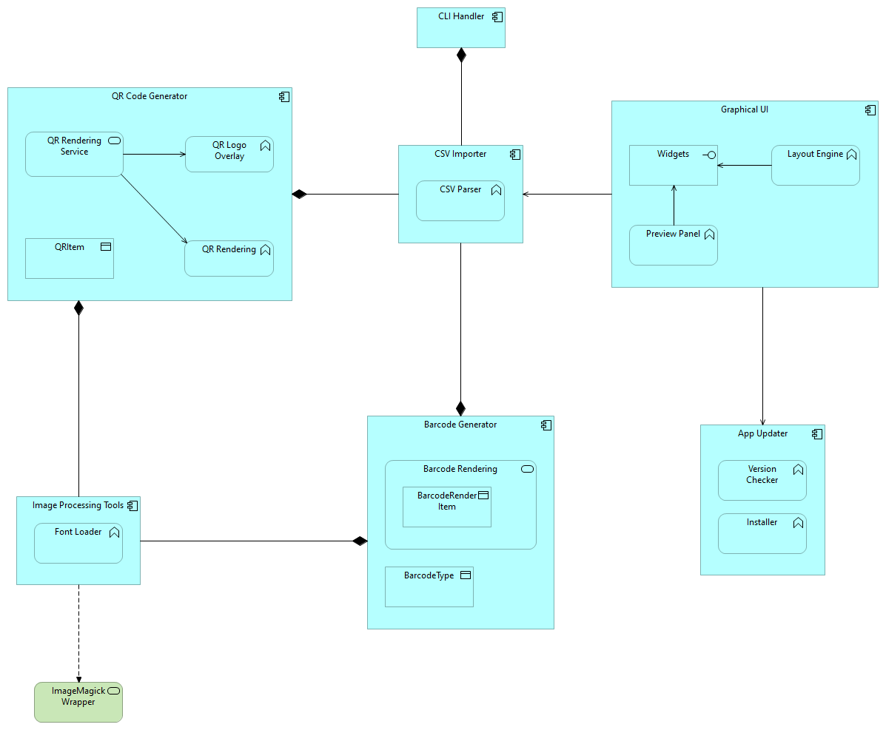

# 🧩 DotPlus — QR & Barcode Generator (CLI + GUI)


**DotPlus** is a cross-platform tool for generating **QR codes** and **barcodes** (EAN-13, EAN-8, Code 39, Code 93, Codabar), optimized for A4 printing and compatible with label printers.

> **🇷🇺 Русская версия ниже**
> 📜 This project uses a **custom license**. See [LICENSE.txt](./LICENSE.txt) for full details.

---

## 🚀 Features

- ✅ **CLI and GUI** (Windows / Linux)
- 🖼️ Add logo overlays to QR codes
- 📄 Full layout customization (columns, rows, spacing, font size, label height)
- 📥 CSV input support
- 📦 Includes ready-to-use batch templates (`.bat`)
- 🔒 Works fully **offline**
- 🐧 Support for Linux and Docker

---

## 📦 Releases

| Platform     | Status    | Packages            | Link                                                                 |
|--------------|-----------|---------------------|----------------------------------------------------------------------|
| 🚀 Windows   | ✅ Stable | `.exe`, `.zip`      | [`release-win`](https://github.com/nigdanil/dotplus/tree/release-win) |
| 🐧 Linux     | ✅ Stable | `.deb`, `.rpm`      | [`release-linux`](https://github.com/nigdanil/dotplus/tree/release-linux) |
| 🐳 Docker    | ✅ Stable | Docker image        | [`release-docker`](https://github.com/nigdanil/dotplus/tree/release-docker) |


---

## 🏗️ Архитектура / Architecture

DotPlus состоит из двух независимых интерфейсов:

* **🖥️ GUI** — визуальный редактор на `egui` с предпросмотром и настройкой параметров.
* **🛠️ CLI** — интерфейс командной строки с поддержкой аргументов и пакетной генерации.

Оба интерфейса используют общее ядро, которое отвечает за:

* 📄 Импорт и парсинг CSV
* 🧾 Генерацию QR-кодов и штрихкодов
* 🖼️ Экспорт изображений

---

### 🇬🇧 English Version

DotPlus is composed of two independent interfaces:

* **🖥️ GUI** — a visual editor built with `egui`, with real-time preview and full layout configuration.
* **🛠️ CLI** — a terminal interface with argument-based control and batch processing support.

Both interfaces share a common core that handles:

* 📄 CSV import and parsing
* 🧾 QR / Barcode generation
* 🖼️ Image export

<details>
<summary>📐 View Architecture Diagram</summary>



</details>

---

## 🧾 CSV Input Format

✅ The file must be **UTF-8 encoded** and include a header row.

Example:

```csv
id,name,url
1,Product A,https://example.com/A
2,Product B,https://example.com/B
```

---

## ⚡ Quick Start (CLI)

### QR Mode:

```bash
dot-plus.exe ^
  --mode qr ^
  --csv "data.csv" ^
  --logo "logo.png" ^
  --output "output/" ^
  --cols 3 ^
  --rows 3 ^
  --qr-size 150 ^
  --font-size 24 ^
  --font-color "#000000"
```

### Barcode Mode:

```bash
dot-plus.exe ^
  --mode barcode ^
  --csv "barcodes.csv" ^
  --output "output/" ^
  --barcode-type EAN-13
```

---

## 📥 License

This software is **not open source**.  
Binaries are provided for **personal** and **evaluation** use only.  
Commercial usage requires written permission from the author.  

See [LICENSE.txt](./LICENSE.txt) for full terms.

---

## 🛠 Author

Created by [nigdanil](https://github.com/nigdanil)

---

## 🇷🇺 Описание на русском

**DotPlus** — генератор **QR-кодов** и **Штрихкодов**, поддерживает форматы EAN-13, EAN-8, Code 39, Code 93, Codabar.
Идеально подходит для печати на A4 и использования в логистике, торговле и документообороте.

### ⚙️ Возможности

* CLI и GUI (Windows / Linux)
* Добавление логотипа в QR
* Настройка макета: количество строк и столбцов, отступы, размер шрифта, высота подписи
* Ввод из CSV
* Поддержка пакетной генерации
* Полная автономность — работает без интернета

### 📦 Релизы

См. [таблицу выше](#releases)

### 📄 Формат CSV

```csv
id,name,url
1,Товар A,https://example.com/A
2,Товар B,https://example.com/B
```
